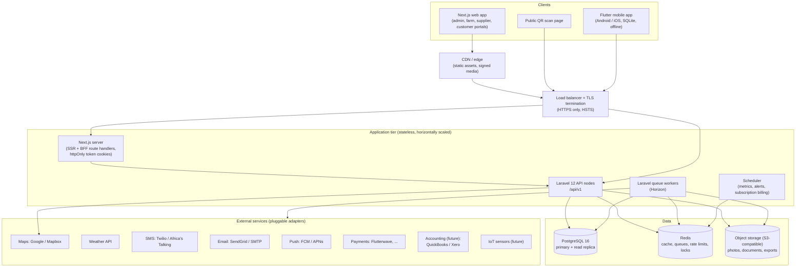
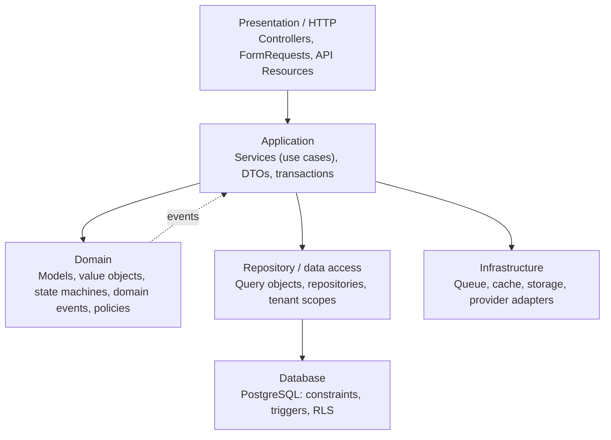

# 01 — System Architecture

## 1. Goals that drive the architecture

| Requirement | Architectural consequence |
|---|---|
| Multi-tenant SaaS, strict farm isolation | Tenant context is resolved on every request and enforced in the data layer, not just the UI ([02](02-tenant-isolation.md)) |
| Platform data vs farm data | Separate API surfaces, guards and route groups for System Admin, farm users and external portals |
| Permanent, auditable traceability | Append-only event store for trace events and audit logs; corrections are new events ([07](07-traceability-and-audit.md)) |
| Offline-first mobile | Client-generated UUIDv7 IDs, sync outbox, idempotent push, cursor-based pull ([08](08-offline-sync.md)) |
| 10,000+ activities/day, <3 s page loads, 99.9% uptime | Stateless API nodes, Redis cache, queued jobs, precomputed dashboard metrics, CDN for media |
| Configurable plans, permissions and integrations | Data-driven plans, permissions and provider settings; nothing hard-coded |

## 2. Deployment view



Notes

- **The mobile app calls the API directly** with bearer tokens. **The web app
  goes through the Next.js server (BFF)**, which keeps the access and refresh
  tokens in `httpOnly`, `Secure`, `SameSite=Lax` cookies, so browser JavaScript
  never sees them. This protects against token theft through XSS. The BFF adds
  CSRF protection for state-changing requests.
- **All slow or external work is queued**: SMS, email, push, PDF and Excel
  exports, image processing, metric roll-ups and webhook handling. The API
  responds without waiting for it.
- **Reports and dashboards read from the replica**, and they only read
  precomputed tables. Writes always go to the primary.
- **Containers.** Everything ships as Docker images: `api`, `worker`,
  `scheduler`, `web`, `postgres`, `redis`, `minio` (local S3) and `mailpit`
  (local mail). The same images run locally with Docker Compose and in
  production on any container platform.

## 3. Repository layout (monorepo)

```
sfmtp/
├── backend/                 Laravel 12 API
├── web/                     Next.js 15 + TypeScript + Tailwind + shadcn/ui
├── mobile/                  Flutter app (Android + iOS)
├── packages/
│   └── api-contracts/       OpenAPI 3.1 spec; source for generated TS + Dart clients
├── infra/
│   ├── docker/              Dockerfiles, compose files
│   └── deploy/              Deployment manifests, backup scripts
└── docs/                    These documents
```

The OpenAPI spec in `packages/api-contracts` is the contract between the three
apps. The TypeScript client (web) and Dart client (mobile) are generated from
it, so the backend and its clients cannot drift apart silently.

## 4. Backend layering

The layers follow the requirements, with one rule: **controllers contain no
business logic.**



| Layer | Contains | Must not |
|---|---|---|
| **HTTP** | Routes, controllers (one action per method), `FormRequest` validation, `JsonResource` output shaping, including field-level hiding | Query the DB directly or contain business rules |
| **Application** | One service per use case (e.g. `RecordHarvest`, `ApprovePurchaseOrder`). Each opens the DB transaction, calls domain logic, persists, emits events | Know about HTTP |
| **Domain** | Eloquent models with invariants, enums, state machines (task, PO, order, subscription status), domain events, Laravel policies | Call external services |
| **Repository** | Reusable query objects, tenant-scoped repositories, reporting queries | Contain business decisions |
| **Infrastructure** | Adapters behind interfaces: `SmsGateway`, `PaymentGateway`, `MapProvider`, `WeatherProvider`, `PushNotifier`, `FileStorage` | Leak provider types into the domain |

### Backend module layout

Each business module is a self-contained folder. This allows the phases to be
built and tested independently:

```
backend/app/Modules/<Module>/
├── Http/{Controllers,Requests,Resources}
├── Application/        # use-case services, DTOs
├── Domain/{Models,Enums,Events,Policies,StateMachines}
├── Infrastructure/     # module-specific adapters, repositories
├── Routes/api.php
├── Database/{migrations,factories,seeders}
└── Tests/{Unit,Feature}
```

Modules: `Platform`, `Identity`, `Tenancy`, `FarmStructure`, `Crops`,
`Livestock`, `Workforce`, `Inventory`, `Procurement`, `Finance`, `Sales`,
`Assets`, `Traceability`, `Media`, `Notifications`, `Reporting`, `Maps`,
`Sync`, `Audit`. The [dependency map](09-module-dependency-map.md) gives the
allowed dependencies between them.

**How modules communicate:**

- **Synchronous interface calls** when the result is needed in the same
  transaction. For example, the Procurement service asks Inventory to receive
  stock when a delivery is received.
- **Domain events** for side effects. Example: `HarvestRecorded` produces a
  trace event, a stock-in, and a notification to the owner.
- **Traceability and audit listeners run synchronously in the same DB
  transaction.** If a trace event can't be written, the business action rolls
  back, so the history can never have gaps.
- **Notifications and metrics listeners are queued.**

## 5. API surfaces

There are four separately guarded route groups, each with its own middleware
stack:

| Surface | Prefix | Who | Tenant context |
|---|---|---|---|
| Platform admin | `/api/v1/admin/*` | System Administrator users only (`platform` guard) | None. Only platform tables and read-only farm *metadata* (status, subscription, counts) |
| Farm | `/api/v1/farms/{farm}/*` | Farm members (owner and staff) | `{farm}` resolved and membership verified by `ResolveFarmContext` middleware |
| Supplier portal | `/api/v1/supplier/*` | Supplier portal accounts | Scoped by the supplier's party ID, which can span multiple farms |
| Customer portal | `/api/v1/customer/*` | Customer portal accounts | Scoped by the customer's party ID, which can span multiple farms |
| Public | `/api/v1/public/*` | Anyone (rate-limited) | QR traceability and published marketplace listings only, with an allow-listed payload |
| Account | `/api/v1/auth/*`, `/api/v1/me/*` | Any authenticated identity | Login, MFA, profile, list of farms and portals the user can access |

A single person may hold several of these (e.g. an agronomist who is also a
customer of another farm). They sign in once and pick a *workspace*, which is
a farm or a portal.

## 6. Authentication and session design

- **Identity.** A single `users` table holds everyone. A `user_type` field
  (`platform_admin`, `member`, `party`) decides which surfaces the user can
  reach at all. A `member` user reaches a farm only through a `farm_users`
  membership row.
- **Tokens.** The access token is a short-lived JWT (15 min) with claims `sub`,
  `typ`, `jti` and `sid`. It carries no roles or farm IDs, because those change
  and are checked on every request. The refresh token is opaque and rotating:
  web 7 days sliding, mobile 30 days. It is stored hashed and revocable per
  device, and reuse of an old refresh token revokes the whole token family.
- **MFA.** TOTP authenticator apps plus one-time recovery codes. SMS OTP is a
  fallback only. MFA is mandatory for System Admin, Farm Owner and Accountant,
  and a farm can make it mandatory for more roles.
- **Passwords.** Hashed with Argon2id. Breached-password checks and lockout with
  exponential back-off. A System Admin can only *trigger* a farm-owner password
  reset (an email or SMS link). The admin never sees or sets the password
  (ADR-0006).
- **Devices.** Each mobile install registers a `user_devices` row (push token,
  platform, last sync). An owner or manager can revoke a lost device.

## 7. Cross-cutting concerns

| Concern | Approach |
|---|---|
| Validation | `FormRequest` classes. Enums and state transitions are also validated in the domain. DB `CHECK` constraints are the last line of defence |
| Errors | RFC 9457 `application/problem+json`, with stable `code` values ([06](06-api-contracts.md)) |
| Transactions | Required for finance, inventory, procurement receipts, sales and payroll. Stock balances are updated with row locks (`SELECT … FOR UPDATE`) |
| Idempotency | An `Idempotency-Key` header is accepted on all POSTs and required from mobile. Stored for 48 h per user |
| Rate limiting | Redis-backed, per user and per IP. Stricter on auth, public QR and exports |
| Caching | Redis. Keys always include `farm:{id}`. Dashboard results are cached 60–300 s and invalidated by domain events |
| Files | Uploaded to object storage under `farms/{farm_id}/…`. MIME type sniffed, size limits enforced, virus-scan hook, EXIF GPS extracted. Served only through short-lived signed URLs |
| Observability | Structured JSON logs with `request_id`, `user_id` and `farm_id`. Metrics and traces via OpenTelemetry. Error tracking (e.g. Sentry). Health endpoints for the admin dashboard |
| i18n | English first, with externalised strings in web and mobile. Units and currency are per farm |
| Time | Everything stored in UTC. Each farm has a timezone setting. Offline records carry both `occurred_at` (device time) and `recorded_at` (server time) |

## 8. Web application structure (Next.js)

- App Router with one **route group per workspace**: `(admin)`, `(farm)/[farmId]`,
  `(supplier)`, `(customer)` and `(public)`. Each group has its own layout,
  navigation and dashboard. There is no shared generic dashboard.
- The navigation is **generated from the permission set** that
  `GET /me/workspaces/{id}` returns, so a menu item only appears when the
  server grants the permission. The server still enforces every call.
- React Query for server state, React Hook Form with Zod for forms (Zod schemas
  are generated from OpenAPI), shadcn/ui components, Recharts for charts,
  MapLibre or the Google Maps JS SDK behind a map adapter, and Framer Motion
  for light transitions. Light and dark themes use CSS variables.

## 9. Mobile application structure (Flutter)

- Feature-first folders. Riverpod for state, Drift (SQLite) for the local
  database, Dio for HTTP with the generated client, WorkManager / BGTaskScheduler
  for background sync, geolocator, camera and image compression.
- Primary users are Field Workers, Farm Managers, Agronomists and Livestock
  Managers. Other roles can use the responsive web app on mobile.
- All writes go to the local DB and a sync outbox first; the UI never waits on
  the network ([08](08-offline-sync.md)).

## 10. Non-functional targets

| Target | How it is met |
|---|---|
| Page load < 3 s | SSR for first paint, precomputed dashboard metrics, paginated lists, lazy-loaded charts and maps, CDN |
| 10,000+ activities/day per platform (sized for 100× that) | Indexed `(farm_id, occurred_at)` access paths, partitioning of `trace_events`, `audit_logs` and `worker_gps` by month, queued side effects |
| 99.9 % availability | At least 2 API nodes, managed Postgres with failover, health checks, zero-downtime migrations (expand → migrate → contract) |
| Backups / DR | Daily full backup plus continuous WAL archiving (point-in-time recovery). Object storage versioning. RPO ≤ 15 min, RTO ≤ 4 h. Restore drill every quarter |
