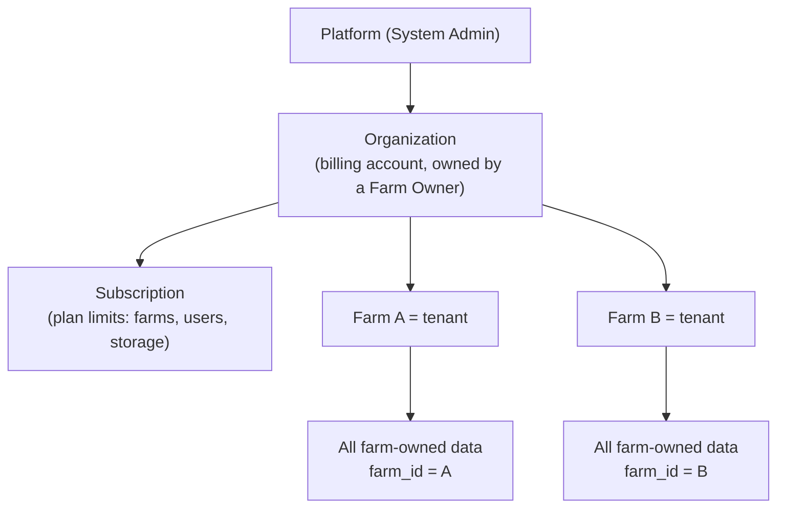

# 02 — Tenant Isolation Strategy

> **Invariant:** A user can read or change a farm-owned record only if the
> server has verified an active membership of that record's farm, and a
> permission in that farm that allows the action. UI hiding is never counted
> as a control.

## 1. Tenancy model

- **The data isolation boundary is the farm.** Every farm-owned row carries
  `farm_id`, as the requirements specify.
- **An organization groups the farms of one owner** and holds the
  subscription. This is needed because plans have *farm limits* and the Farm
  Owner menu has *"My Farms"* ([ADR-0001](adr/0001-organization-above-farm.md)).
  The organization is only used for billing and the owner's roll-up view. It
  never leaks data between farms: membership and permissions are still
  granted per farm.
- **Platform tables** (`subscription_plans`, `global_*` catalogues, logs,
  support tickets) have no `farm_id` and are managed only by the System Admin.
- **Suppliers and customers.** Their portal accounts (*parties*) are global.
  Each farm keeps its own `suppliers` / `customers` rows (with `farm_id`), and
  these link to the party account. A portal user sees only the rows that link
  to their party ([ADR-0002](adr/0002-external-parties.md)).

## 2. Seven layers of enforcement (defence in depth)

| # | Layer | Mechanism | What it catches |
|---|---|---|---|
| 1 | **Routing** | Farm APIs live only under `/api/v1/farms/{farm}/…`. The admin and portal route groups have no farm-scoped operational routes | Admin accidentally reaching operational endpoints |
| 2 | **Context middleware** | `ResolveFarmContext` loads the `farm_users` membership for (`auth user`, `{farm}`). It returns **404** (not 403, so a farm's existence isn't revealed) if the membership is missing, suspended, or the farm is suspended. It then binds a request-scoped `TenantContext` | Guessing other farm IDs |
| 3 | **Authorization** | Laravel policies check `module.resource.action` permissions from the member's farm role(s), and record-level scope (`own`, `assigned`) ([04](04-roles-and-permissions.md)) | Role overreach within a farm |
| 4 | **ORM global scope** | The `BelongsToFarm` trait on every farm-owned model adds `where farm_id = ?` from `TenantContext` and sets `farm_id` on create. Reads with no context **throw**; they don't silently return everything | A developer forgetting a `where` clause |
| 5 | **Composite foreign keys** | Child tables reference parents by `(farm_id, id)`. The database therefore rejects a crop cycle in Farm A pointing to a plot in Farm B | Cross-tenant references from IDs supplied in the request |
| 6 | **PostgreSQL Row-Level Security** | RLS policies `USING (farm_id = current_setting('app.farm_id')::uuid)` on farm tables. The app sets `SET LOCAL app.farm_id` inside each request transaction. The application DB role is not the table owner, so it cannot bypass RLS | Raw SQL or reporting queries that skip the ORM |
| 7 | **Tests** | An auto-generated **cross-tenant test suite** that visits every farm route as a member of another farm, plus the role-boundary tests listed in the requirements | Regressions |

Layers 1–5 are needed from Phase 1. Layer 6 (RLS) is enabled in Phase 1 for
the pilot tables and extended to all farm tables before production (Phase 15).
RLS is PostgreSQL-only; the [MySQL compatibility notes](#6-mysql-compatibility)
explain what replaces it there.

## 3. Resolving tenant context outside HTTP

| Entry point | How context is set |
|---|---|
| Queued jobs | Every farm-scoped job implements `TenantAware` and serializes `farm_id`. Middleware restores `TenantContext` and `SET LOCAL app.farm_id` before `handle()` runs |
| Scheduled tasks | Iterate farms explicitly: `Farm::active()->each(fn ($f) => TenantContext::run($f, …))`. They never query across farms in one scope |
| Platform reporting (admin) | Uses a dedicated **read-only DB role** limited to platform tables and aggregate views (`v_farm_usage_stats`) that expose counts and storage, never records |
| Console / tinker | Must call `TenantContext::run()`. Without it the global scope throws |
| Portals | `PartyContext` (supplier or customer party ID) instead of farm context. Portal queries filter by `party_id` and by the farm's permission for that portal feature |

## 4. Tenant-scoped resources beyond the database

| Resource | Rule |
|---|---|
| Object storage | Keys are `farms/{farm_id}/{module}/{uuid}`. Download only through a signed URL issued after a policy check (5-minute TTL) |
| Cache | Every key starts with `farm:{farm_id}:`. Tags are per farm so a farm's cache can be flushed |
| Search | Every search query includes a `farm_id` filter (Postgres full-text search to start with) |
| Queues | One queue for everyone, but each job carries its farm. Per-farm rate limits on heavy jobs (exports) stop one tenant from starving others |
| Exports (PDF/Excel) | Generated in tenant context, stored under the farm prefix, link expires in 24 h |
| Logs | Include `farm_id` for support. Never contain secrets or personal financial data |
| Notifications | Recipients are resolved inside the farm context. Messages never include data from other farms |
| Unique codes | Farm-level codes are unique per farm (`unique(farm_id, code)`). Batch IDs and QR codes are **globally** unique because they are public |

## 5. System Administrator boundary

The System Admin runs the SaaS; it is not a member of any farm
(requirements §5 and §7).

- Admin users have `user_type = platform_admin` and **cannot hold
  `farm_users` rows**. A DB check plus a trigger rejects such a row.
- The admin can: approve, suspend or unsuspend farms; manage subscriptions,
  plans and global catalogues; trigger owner password resets; view aggregate
  usage.
- The admin **cannot** call any `/farms/{farm}/…` route, and has no policy that
  allows operational models.
- **Support access** (optional, [ADR-0005](adr/0005-support-access.md)): the Farm
  Owner can grant time-boxed, **read-only** support access, e.g. 24 h, for one
  support ticket. During that window a scoped support session exists. Every
  request in it is audit-logged and visible to the owner. Write actions stay
  impossible.

## 6. MySQL compatibility

The requirements ask for MySQL compatibility where applicable. PostgreSQL is
the primary, supported engine. For MySQL 8.0+:

| PostgreSQL feature | MySQL equivalent / impact |
|---|---|
| Row-Level Security | **Not available.** Isolation relies on layers 1–5 and 7. Document as a reduced-assurance mode |
| `uuid` type | `CHAR(36)` (Laravel's portable `uuid` column; UUIDv7 keeps it time-ordered). `BINARY(16)` is a later optimisation if MySQL becomes a production target |
| `jsonb` + GIN indexes | `JSON` plus generated columns for indexed keys |
| Partial / expression indexes | Generated columns plus normal indexes |
| `CHECK` constraints | Supported (8.0.16+) |
| Triggers blocking UPDATE/DELETE on append-only tables | Supported (`SIGNAL SQLSTATE`) |
| PostGIS (plot boundaries) | MySQL spatial types (`POLYGON`, `ST_*`). Fewer functions available |
| Declarative partitioning | Supported, but partitioned tables can't have foreign keys, so trace/audit tables drop their FKs on MySQL |

Migrations use Laravel's schema builder. Engine-specific statements (RLS,
triggers, PostGIS) live in separate driver-guarded migrations, and CI runs the
test suite on both engines.

## 7. Required tests (release gate)

1. For every route under `/farms/{farm}`: a member of Farm B calling it with
   Farm A's ID, or with Farm A's record IDs under Farm B's path, gets
   **404**, and no row changes.
2. A request body that references another farm's record (e.g. `plot_id` from
   Farm B) is rejected with **422**. The composite FK is the backstop.
3. A job dispatched for Farm A cannot read Farm B data (unit test with RLS on).
4. The System Admin gets **403/404** on every farm operational route and
   cannot create a `farm_users` row.
5. A supplier sees only POs for their party. A customer sees only their own
   orders and public traceability.
6. Suspending a farm blocks its members' API access (except the owner's
   billing screens) within one request.
7. The role-boundary tests listed in the requirements (§42) — see [04 §6](04-roles-and-permissions.md#6-mandatory-role-boundary-tests).
