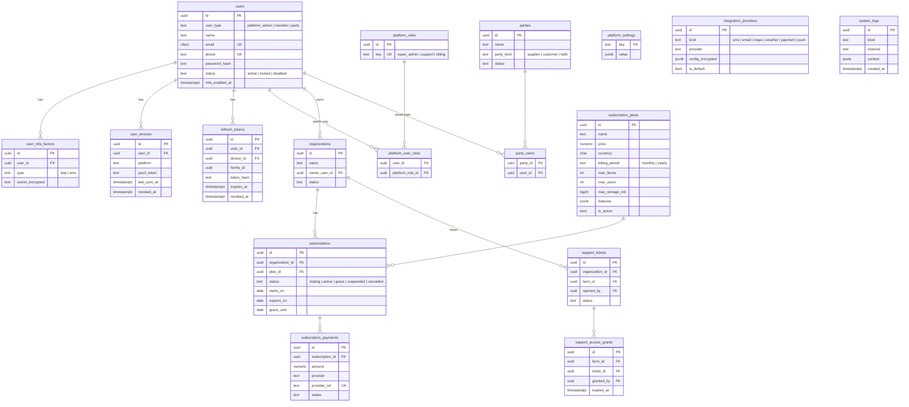
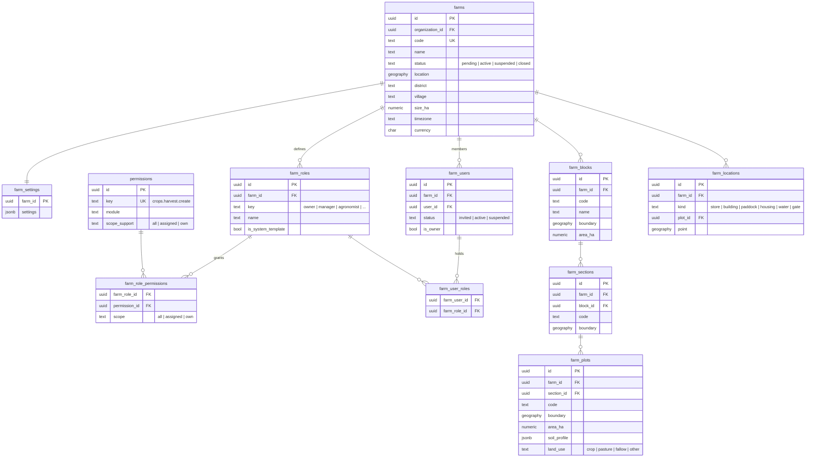
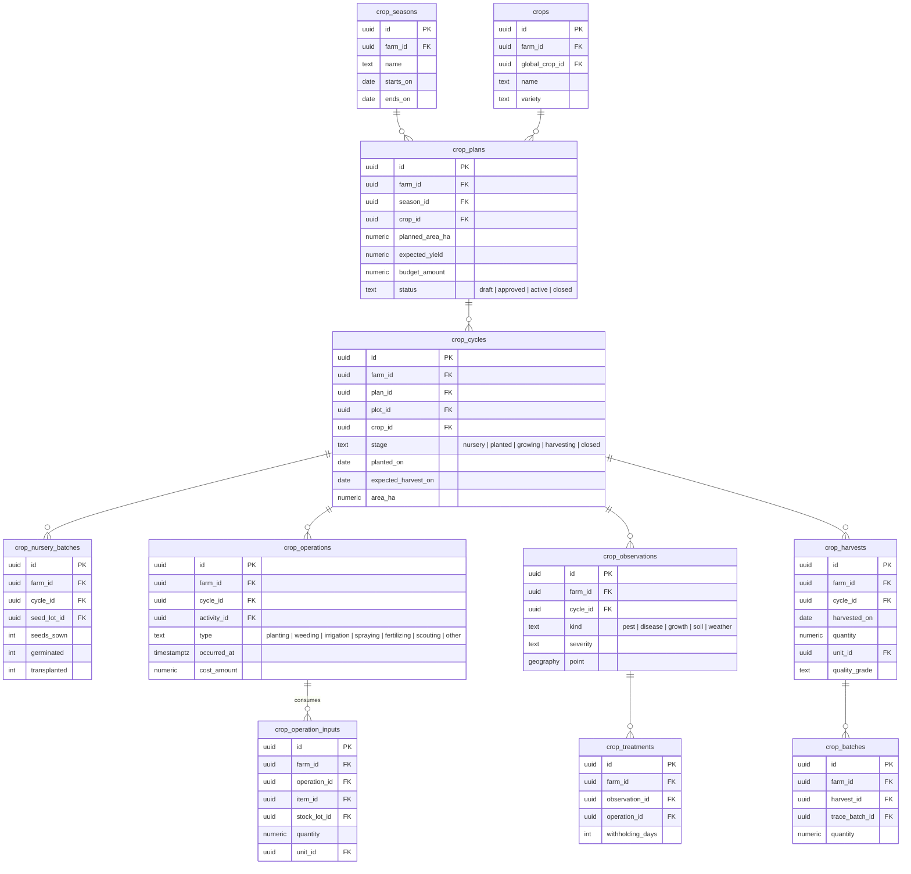
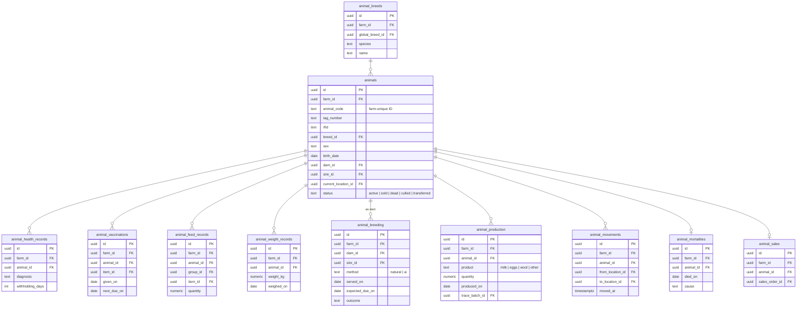
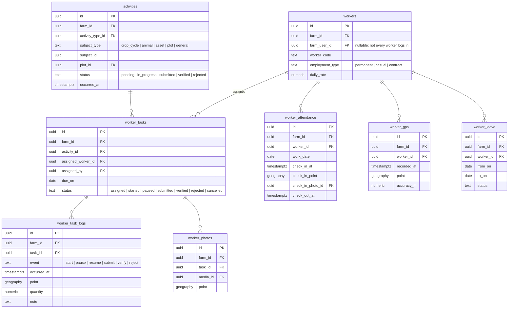
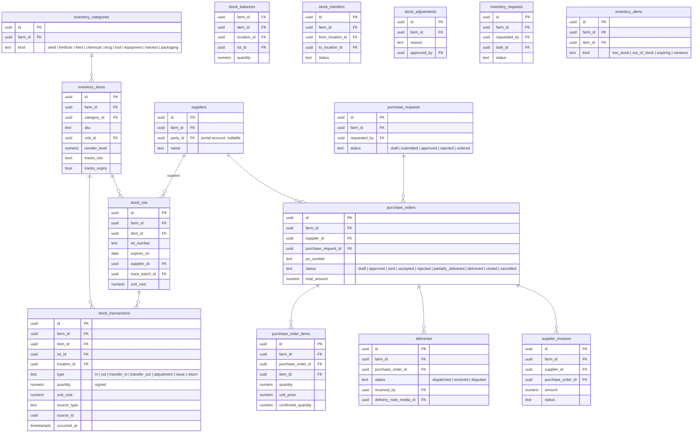
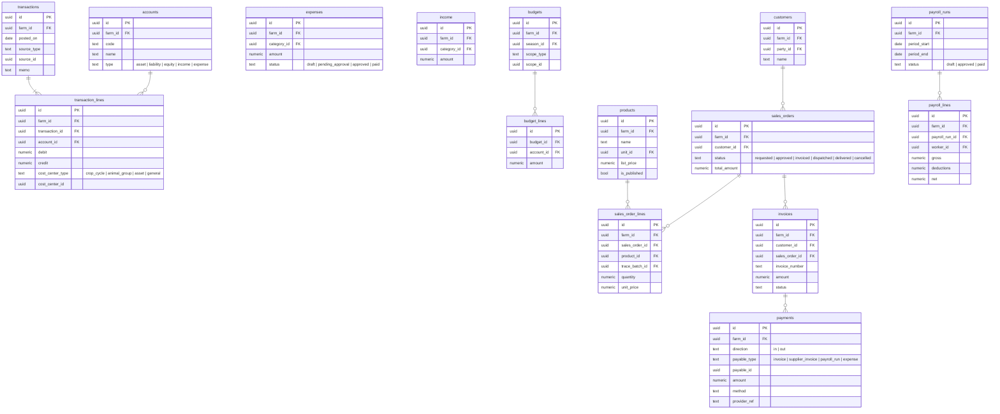
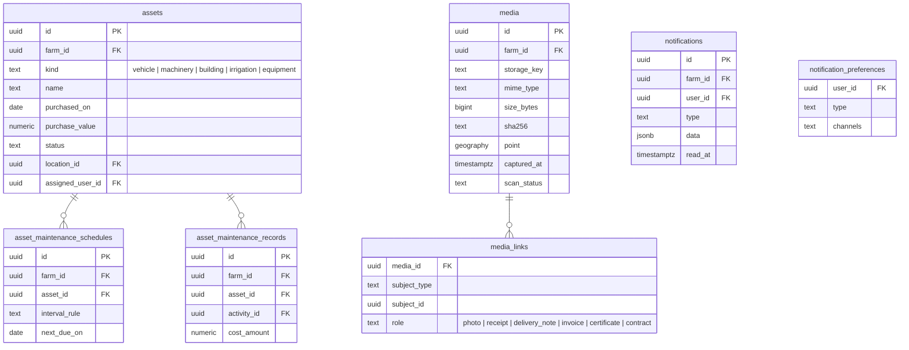
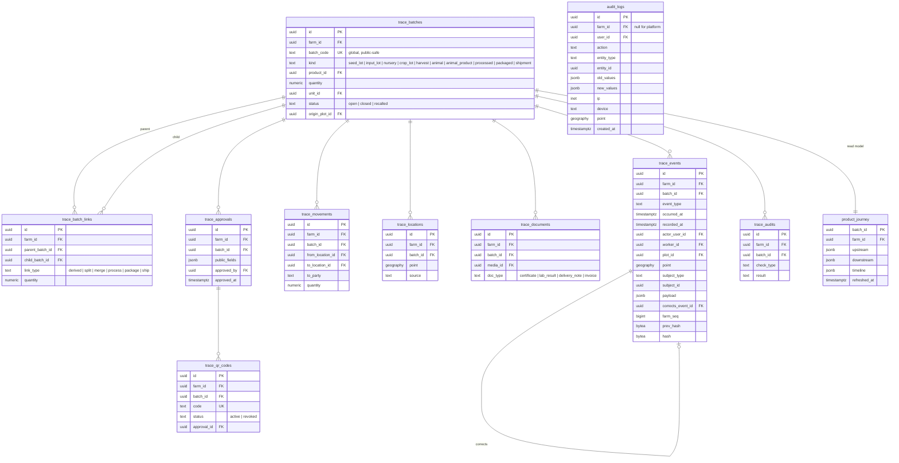

# 03 — Database Design & ERD

PostgreSQL 16 (with PostGIS) is the primary engine. The MySQL notes are in
[02 §6](02-tenant-isolation.md#6-mysql-compatibility).

## 1. Conventions (apply to every table unless stated)

| Convention | Rule | Why |
|---|---|---|
| Primary keys | `id uuid` (UUIDv7) | The mobile app creates records offline; time-ordered UUIDs keep B-tree indexes efficient |
| Tenant column | `farm_id uuid not null` on every farm-owned table, first column of most indexes | Isolation plus fast per-farm scans |
| Composite uniqueness | `unique (farm_id, id)` on every farm table | Lets child tables use composite FKs `(farm_id, parent_id) → parent(farm_id, id)` so cross-farm references are impossible |
| Business codes | `unique (farm_id, code)` for farm codes; globally unique for `batch_code` and `qr_code` | Readable IDs that are public where required |
| Audit columns | `created_at`, `updated_at`, `created_by`, `updated_by` | Who and when |
| Sync columns | `version integer not null default 1` (optimistic locking), `client_created_at`, `device_id` on mobile-writable tables | Offline conflict detection |
| Soft delete | `deleted_at` on master data only (plots, items, suppliers…). **Never** on trace, audit, stock-ledger or finance-ledger tables; those are append-only | Keep history |
| Money | `numeric(14,2)` plus a `currency char(3)` column. Farm default currency in `farm_settings` | No floating-point money |
| Quantities | `numeric(14,3)` plus `unit_id` → `units` | Kg, litres, heads, bags… |
| Enums | `text` + `CHECK (col IN (…))`, mirrored by PHP backed enums | Portable across Postgres and MySQL |
| Status history | State changes are written to `<entity>_status_history` or trace events, not just overwritten | Auditability |
| Geo | GPS points as `latitude` / `longitude` decimals plus `gps_accuracy_m`; boundaries as GeoJSON with derived area, centroid and bounding box ([ADR-0009](adr/0009-geojson-geometry.md)). The diagrams below still say `geography` for brevity | Maps and geo-traceability on both engines |
| Large append-only tables | Range-partitioned by month: `trace_events`, `audit_logs`, `worker_gps`, `notifications`, `system_logs` | Performance and retention |

Diagrams show the key columns and relationships only. The complete column
lists are produced as migrations in Phase 1 and later phases.

## 2. Platform & identity

**Global catalogues** (platform-owned, read-only for farms): `global_crops`,
`global_crop_varieties`, `global_animal_species`, `global_animal_breeds`,
`units`, `global_inventory_categories`, `global_activity_types`. Farms
reference them, and can add farm-local entries in `crops`, `animal_breeds`
etc., which optionally point to the global entry.

> The requirements list a platform `payments` table and a finance `payments`
> table. Here the platform one is **`subscription_payments`**, so the names
> don't clash and platform data is never mixed with farm data ([ADR-0004](adr/0004-table-naming.md)).

## 3. Farm, structure & membership

Constraints

- `farm_users unique (farm_id, user_id)`. A partial unique index allows only
  one `is_owner = true` per farm.
- A trigger rejects `farm_users` rows whose user has
  `user_type = 'platform_admin'` ([02 §5](02-tenant-isolation.md#5-system-administrator-boundary)).
- `farm_plots.boundary` should lie inside its section's boundary, and plots
  should not overlap. The service checks both and returns warnings, not
  failures, because GPS data is imprecise ([ADR-0009](adr/0009-geojson-geometry.md)).
- `farm_sections.block_id`, `farm_plots.section_id` (nullable: a plot can sit
  directly under the farm) and `farm_locations.plot_id` are composite
  `(farm_id, …)` foreign keys. Structure rows are archived (`deleted_at`),
  and `code` is unique per farm including archived rows.
- `farm_invitations` holds a SHA-256 hash of the emailed token, the invited
  email, expiry (7 days) and accepted / revoked markers;
  `farm_invitation_roles` links it to `farm_roles` by composite key.

## 4. Crops

`crop_cycles.plot_id` references `farm_plots` through `(farm_id, plot_id)`.
A partial unique index prevents two *active* cycles overlapping on the same
plot, unless intercropping is enabled for the farm.

## 5. Livestock

- `unique (farm_id, animal_code)`. Every animal also receives a global
  `trace_batch` of type `animal`, which gives it a public-safe unique ID.
- `dam_id` and `sire_id` are self-references within the same farm. Animals
  bought from outside the farm record their parentage as text.
- `animal_groups` (herds/flocks) and `animal_group_members` allow group
  feeding and group treatment for poultry and small stock.

## 6. Workers & activities

`activities` is the **single, generic record of work done**. Crop operations,
animal treatments and asset maintenance each point to an activity, which
gives one timeline, one verification flow and one activity map across all
modules. Payroll lives in Finance (`payroll_runs`, `payroll_lines`), fed by
attendance and verified tasks.

## 7. Inventory & procurement

- **`stock_transactions` is the append-only ledger.** `stock_balances` is a
  derived projection, updated inside the same transaction with a row lock.
  Adjustments are new transactions; ledger rows are never edited.
- A `CHECK` constraint plus a service rule keep `stock_balances.quantity >= 0`,
  unless the farm allows negative stock.
- Valuation uses **weighted average cost** per item and location. FIFO by lot
  is optional, per farm.

## 8. Finance & sales

- **Double-entry core.** Every expense, income, invoice, payment, payroll run
  and stock valuation change posts a balanced `transaction` (a deferred
  constraint trigger checks sum(debit) = sum(credit)). Profit & Loss, cash
  flow, and cost per crop or per acre all come from the same ledger, using
  cost centres such as `crop_cycle` and `animal_group`.
- The simple `expenses` / `income` tables are the user-facing documents;
  posting creates the ledger entries. Accountants never have to write
  journal entries for day-to-day work.
- Posted transactions are immutable. Corrections are made with reversing
  entries.

## 9. Assets, media, notifications

## 10. Traceability & audit

Design details: [07 — Traceability & Audit](07-traceability-and-audit.md).

## 11. Sync support tables

| Table | Purpose |
|---|---|
| `sync_mutations` | Processed mobile mutations: `(device_id, mutation_id)` unique, plus result. This makes push idempotent |
| `sync_changes` | Per-farm change feed: `farm_seq bigserial`, `entity_type`, `entity_id`, `op`, `changed_at`. Pull reads it from a cursor |
| `sync_conflicts` | Conflicts waiting for a user decision |

## 12. Key indexes (initial set)

| Table | Index |
|---|---|
| All farm tables | `(farm_id, id)` unique; `(farm_id, updated_at)` for sync |
| `activities`, `worker_tasks` | `(farm_id, status, due_on)`, `(farm_id, assigned_worker_id, due_on)` |
| `trace_events` | `(farm_id, batch_id, occurred_at)`, `(farm_id, subject_type, subject_id)` |
| `trace_batch_links` | `(parent_batch_id)`, `(child_batch_id)` |
| `stock_transactions` | `(farm_id, item_id, occurred_at)` |
| `stock_balances` | unique `(farm_id, item_id, location_id, lot_id)` |
| `transaction_lines` | `(farm_id, account_id)`, `(farm_id, cost_center_type, cost_center_id)` |
| `worker_gps` | `(farm_id, worker_id, recorded_at)` + GiST on `point` |
| `farm_plots`, `farm_blocks` | GiST on `boundary` |
| `animals` | `(farm_id, status)`, unique `(farm_id, animal_code)` |
| `audit_logs` | `(farm_id, entity_type, entity_id, created_at)` |
