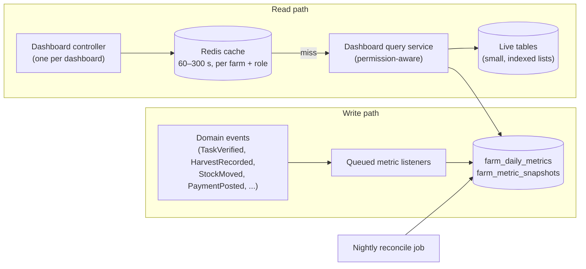

# 05 — Dashboard Architecture

The requirements call for **ten distinct dashboard experiences**. Each has
its own layout, KPIs, widgets and quick actions, built around the decisions
that role makes every day. They are not one generic dashboard with a
different menu.

## 1. How dashboards are built

- **KPIs and charts** read from precomputed tables:
  - `farm_daily_metrics (farm_id, date, metric_key, dimension, value)`
  - `farm_metric_snapshots` (point-in-time values such as stock value or
    head count)

  Queued listeners update these incrementally. A nightly job recomputes the
  previous 7 days to correct any drift.
- **Action lists** (today's tasks, approvals, low stock) are live queries on
  indexed tables, limited to about 10 rows with a "view all" link.
- **One summary endpoint per dashboard**, plus **one endpoint per heavy
  widget** (charts, maps). The page renders progressively and one slow widget
  never blocks the rest ([06](06-api-contracts.md#3-dashboard-contracts)).
- **Permission-aware.** The server leaves out any widget or field the member
  isn't permitted to see. A customised role therefore gets a trimmed
  dashboard automatically.
- **Several roles.** A member with several roles gets a dashboard switcher.
  The default is their highest-precedence role: Owner > Manager > Accountant >
  Agronomist / Livestock Manager / Store Manager > Field Worker.

## 2. Frontend composition

- A widget registry maps `widget.key` → React component. The server response
  lists which widgets to show and in what order. The client never decides
  visibility itself.
- Shared components: `KpiCard`, `TrendChart`, `BarCompare`, `ActionList`,
  `ApprovalQueue`, `MapPanel`, `Timeline`, `AlertFeed`, `QuickActionBar`.
- Each dashboard is a separate route and layout file, so each can evolve
  independently.
- Standard page shape: top KPI strip, a primary decision area (queues and
  alerts), charts, then quick actions (a sticky bar on mobile).

## 3. The ten dashboards

### 3.1 System Administrator — `/admin`

| Zone | Content |
|---|---|
| KPIs | Registered farms, pending approvals, active / suspended farms, active subscriptions, MRR and revenue this month, total users, API uptime and p95 latency, DB health, storage used, last backup status, error rate (24 h), open support tickets |
| Decision area | Farm approval queue · failed subscription payments · subscriptions expiring within 14 days · critical errors |
| Charts | Farm sign-ups per month · revenue per month · API error rate |
| Quick actions | Approve farm · suspend farm · manage plans · global crops / breeds / units · integrations · logs · support |
| Data sources | Platform tables and aggregate views only. **No operational farm data**, and no drill-down into a farm's records |

### 3.2 Farm Owner — `/farms/{id}` (role `owner`)

| Zone | Content |
|---|---|
| KPIs | Farm area, revenue, expenses, net profit (period), crop performance index, livestock production, inventory value, worker productivity, outstanding receivables and payables, pending approvals |
| Decision area | Approvals (expenses, POs, sales, stock adjustments above threshold) · disease alerts · unverified activities · low stock · traceability alerts (unpublished batches, missing evidence) |
| Charts | Revenue vs expenses (12 months) · profit trend · crop yield per crop · cost and yield per acre · livestock production trend |
| Widgets | Today's activities · upcoming harvests · payments due · farm map snapshot |
| Multi-farm | "My Farms" roll-up across the organization: one row per farm with its headline KPIs. Each farm is still checked for permission individually |

### 3.3 Farm Manager

| Zone | Content |
|---|---|
| KPIs | Today's tasks, completed / pending / overdue tasks, workers present / absent, active crop and livestock activities, inventory requests, pending approvals |
| Decision area | Overdue tasks · submitted tasks awaiting verification · leave requests · inventory requests |
| Widgets | Schedule (day / week) · live worker activity (last GPS, current task) · recent activity feed · alerts |
| Quick actions | Assign task · approve task · assign worker · create activity · approve leave · report issue · view map |

### 3.4 Agronomist

| Zone | Content |
|---|---|
| KPIs | Active crop cycles, planted area, crops near harvest (≤14 days), expected vs actual yield, yield per acre, crop health score, pest / disease incidents (open), treatments in progress |
| Decision area | Pest and disease alerts by severity · operations due (spraying, fertilizing, irrigation) · treatments with withholding periods ending |
| Widgets | Crop calendar · crop health by plot (map) · expected vs actual yield chart · weather forecast |
| Quick actions | Crop plan · planting · fertilizer · spraying · irrigation · disease report · treatment plan · harvest |
| Excludes | Money values, livestock |

### 3.5 Livestock Manager

| Zone | Content |
|---|---|
| KPIs | Total animals (by species), new animals (period), pregnant, vaccinations due (7 days), under treatment, mortality rate, production (milk / eggs) today and trend, average daily weight gain, animals sold |
| Decision area | Vaccinations due · treatments and withdrawal periods · expected births · animals with abnormal weight loss |
| Widgets | Animal health overview · breeding calendar · production chart · movement log / paddock occupancy |
| Quick actions | Register animal · feeding · vaccination · treatment · weight · breeding · production · mortality · sale request |
| Excludes | Money values, crops |

### 3.6 Store Manager

| Zone | Content |
|---|---|
| KPIs | Stock items, low-stock and out-of-stock items, stock value ($ only with `inventory.values.view`, on by default for this role), received and issued today, pending requests, expected deliveries |
| Decision area | Pending issue requests · deliveries to receive · expiring lots (30 days) · variance alerts |
| Widgets | Inventory status by category · recent stock movements |
| Quick actions | Stock in · stock out · issue · transfer · approve issue · receive delivery · purchase request · inventory report |

### 3.7 Accountant

| Zone | Content |
|---|---|
| KPIs | Revenue, expenses, net profit, cash balance, outstanding customer and supplier payments, payroll (current period), budget and variance |
| Decision area | Supplier invoices due · overdue customer invoices · payroll awaiting approval · expenses awaiting posting |
| Charts | Income vs expenses · budget vs actual per cost centre · cash flow forecast (90 days) |
| Widgets | Recent transactions · supplier invoices · customer invoices |
| Quick actions | Expense · income · invoice · supplier payment · customer payment · payroll · budget · P&L · cash flow |

### 3.8 Field Worker (mobile-first)

| Zone | Content |
|---|---|
| Header | Check-in / check-out button with GPS + photo, and sync status (pending items, last sync) |
| Main | Today's tasks as large cards: Start / Pause / Complete, record quantity, photo, note, report problem |
| Other | Notifications · my attendance this week |
| Excludes | Any money, stock values, payroll, other workers' tasks |
| Offline | Everything on this screen works offline ([08](08-offline-sync.md)) |

### 3.9 Supplier portal

| Zone | Content |
|---|---|
| KPIs | New POs, pending POs, deliveries in progress, completed orders, outstanding invoices, payments received |
| Widgets | Purchase orders (with farm name) · delivery status |
| Actions | View / accept / reject PO · confirm quantities · confirm dispatch · upload delivery note and invoice · view payment status |

### 3.10 Customer portal

| Zone | Content |
|---|---|
| KPIs | Available products, active orders, delivered orders, pending payments, total purchases |
| Widgets | Product marketplace · order tracking timeline |
| Actions | Browse · order · pay · track · confirm delivery · view history · scan / view QR traceability |

## 4. Metric catalogue (excerpt)

Each metric is defined once and reused by every dashboard and report that
needs it:

| Key | Definition | Source |
|---|---|---|
| `tasks.completed` | Tasks reaching `verified` on the date | `worker_tasks` status history |
| `tasks.overdue` | Open tasks with `due_on < today` | live |
| `workers.present` | Distinct workers with check-in on the date | `worker_attendance` |
| `crop.yield_per_ha` | Σ harvest qty ÷ cycle area, per crop and season | `crop_harvests`, `crop_cycles` |
| `crop.cost_per_ha` | Σ ledger debits with cost centre = cycle ÷ area | `transaction_lines` |
| `livestock.milk_litres` | Σ production where product = milk | `animal_production` |
| `livestock.mortality_rate` | Deaths ÷ average head count (period) | `animal_mortalities`, snapshots |
| `inventory.value` | Σ balance × weighted average cost | `stock_balances`, snapshot |
| `finance.revenue` / `finance.expenses` | Σ income / expense account lines | ledger |
| `finance.cash_balance` | Σ cash and bank accounts | ledger |
| `trace.unverified_activities` | Activities `submitted` > 48 h | live |
| `platform.mrr` | Σ active subscription price normalised to a month | `subscriptions` |
