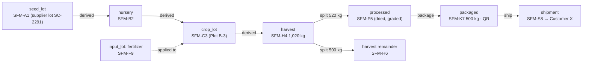

# 07 — Traceability & Audit Design

Traceability is SFMTP's flagship feature. The design has to answer two
questions for any product: **"Where did this come from?"** (backward) and
**"Where did this batch go?"** (forward). Every answer has to hold up in an
audit.

## 1. Model: a batch graph plus an append-only event log



- **`trace_batches`** are the nodes. Anything that can be traced gets one:
  seed and input lots, nursery batches, crop lots (one per crop cycle),
  harvests, animals, animal-product lots (e.g. a day's milk), processed and
  packaged products, and shipments.
- **`trace_batch_links`** are the directed edges (`derived`, `split`,
  `merge`, `process`, `package`, `ship`), with quantities. Backward trace
  follows edges upstream; forward trace follows them downstream. Both are one
  recursive CTE:

  ```sql
  WITH RECURSIVE up AS (
    SELECT parent_batch_id, child_batch_id, 1 AS depth
    FROM trace_batch_links WHERE child_batch_id = :batch AND farm_id = :farm
    UNION ALL
    SELECT l.parent_batch_id, l.child_batch_id, up.depth + 1
    FROM trace_batch_links l JOIN up ON l.child_batch_id = up.parent_batch_id
    WHERE up.depth < 50
  ) SELECT * FROM up;
  ```

- Input usage (fertilizer on a crop lot, drug given to an animal) is recorded
  as an **`input_applied` event** that references the input lot. It is not a
  graph edge, because inputs are consumed rather than transformed into the
  product. The journey endpoint still reports them under `/inputs`.
- **`trace_events`** record everything that happens to a batch: planting,
  each field operation, the worker, time, plot, GPS, photos and documents,
  harvest, storage moves, processing, packaging, sale and delivery. Each
  event points back to the domain record (`subject_type`, `subject_id`) that
  holds the full details.

## 2. How events are produced

Traceability is **automatic**. Users don't "enter trace data" separately; it
comes out of normal work:

| Domain action (service) | Trace effect |
|---|---|
| Delivery received with lot number | Create `input_lot` / `seed_lot` batch, event `received` (supplier, PO, delivery note) |
| Crop cycle started on a plot | Create `crop_lot` batch linked from the seed lot / nursery batch, event `planted` |
| Crop operation verified | Event `operation` (+ `input_applied` per input lot, worker, GPS, photos) |
| Harvest recorded | Create `harvest` batch linked from the crop lot, event `harvested`. Creates a stock lot in the store |
| Stock transfer | Event `moved` + `trace_movements` row |
| Processing / packaging | New batch, `process` / `package` links, events |
| Animal registered / born | `animal` batch (parents linked if known) |
| Animal treatment, vaccination, movement | Events on the animal batch (withholding periods carried) |
| Milk / eggs recorded | Daily `animal_product` batch linked from the contributing animals or group |
| Sales order dispatched | `shipment` batch linked from the sold batch(es), event `dispatched` (customer) |
| Delivery confirmed by customer | Event `delivered` |

A `Traceability\Recorder` service is called by listeners that run
**synchronously in the same DB transaction** as the business action. If the
trace write fails, the business action rolls back, so the history can never
have gaps.

Offline-created events keep both `occurred_at` (the device's time) and
`recorded_at` (the server's time). The timeline sorts by `occurred_at` and
shows a "recorded later" badge when the two differ by more than an hour.

## 3. Immutability

| Mechanism | Detail |
|---|---|
| No updates or deletes | `BEFORE UPDATE OR DELETE` triggers on `trace_events`, `trace_batch_links`, `trace_movements`, `audit_logs`, `stock_transactions`, and posted `transactions` / `transaction_lines` raise an exception |
| DB privileges | The application DB role has only `INSERT, SELECT` on these tables. Migrations run as a separate owner role |
| Corrections | `POST …/events/{id}/corrections` inserts a new event with `corrects_event_id` and the corrected payload. Read models show the latest value and a "corrected" marker with the history |
| Batch status | Batches can be `closed` or `recalled` through events. Their status column is updated only by the Recorder, and each change also writes an event |
| Tamper evidence | Each farm's events form a hash chain: `hash = SHA-256(prev_hash ‖ canonical_json(event))`, with `farm_seq` taken from a per-farm sequence. A nightly job (`trace_audits`) re-verifies the chain and alerts on a mismatch. An optional daily anchor digest is stored in platform storage |
| Retention | Trace and audit data are kept for the life of the farm account, plus a retention period after closure (default 7 years, configurable) |

## 4. Read model: `product_journey`

Walking the graph for every public QR scan would be expensive. So:

- `product_journey` holds a precomputed upstream and downstream graph and
  timeline for each batch (JSONB).
- A queued projector refreshes it whenever a relevant event or link is
  written. Up to about 10 s of staleness is acceptable.
- The farm-internal journey endpoint can bypass the projection
  (`?fresh=true`) to walk the graph live.

## 5. QR codes and public traceability

1. A permitted user reviews the batch and chooses which fields to make
   public. This creates a `trace_approvals` row with `public_fields` and the
   approver.
2. A QR code is issued: `trace_qr_codes.code` is a random 10–12 character
   base32 string (not guessable, not the batch UUID). The QR encodes
   `https://trace.<domain>/q/{code}`.
3. `GET /public/trace/{code}` returns only the approved fields from the
   projection, with a signature so partners can verify it.
4. The code can be revoked (e.g. after a recall); the scan page then shows a
   *recalled / withdrawn* notice.
5. Scans are counted (time, coarse country or region from IP) for the owner
   dashboard. No personal data about the person scanning is stored.

Fields that can **never** be public, even if approved: prices, costs, margins,
supplier prices, worker personal details, exact GPS (it is rounded to the
district), and stock levels.

## 6. The eight traceability views (requirements §27)

| View | How it's answered |
|---|---|
| Backward | Upstream graph walk to the seed / input lots and suppliers |
| Forward | Downstream graph walk to shipments and customers |
| Internal | Events for movements between plots, stores and processing within the farm |
| Supply chain | Supplier → PO → delivery → lot → usage events |
| Geographic | Plot boundaries + `trace_locations` + GPS on events → map |
| Worker | `worker_id` on events → which workers touched which batches |
| Financial | Cost-centre ledger lines for the crop cycle / animal group → cost per batch (internal only) |
| Batch | Batch details, splits and merges, quantities, documents, certifications |

## 7. Audit trail (separate from traceability)

Traceability records *what happened to products*. The audit trail records
*what users did in the system*.

- `audit_logs` rows are written by an `Auditable` model observer and by
  explicit calls for non-model actions (login, MFA change, export, approval,
  permission change, support access).
- Fields: user, farm (null for platform), action, entity, old and new values
  (sensitive fields masked), time, IP, device, GPS (mobile), request ID.
- Append-only (§3). The table is partitioned by month.
- Owners see their farm's audit log. The System Admin sees platform actions
  and admin actions only.
