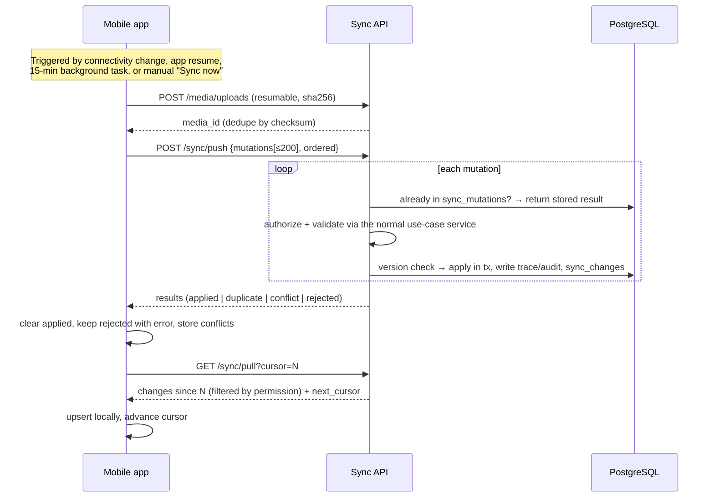

# 08 — Offline-First Sync Design

> **Phase 6 status.** The protocol below is implemented for the field
> worker's data: task steps, task photos, attendance, GPS points and leave
> requests are pushed; tasks, attendance, leave and the worker profile are
> pulled. Push results also include `deferred` (a photo not uploaded yet)
> and `error` (retry later). How the server applies mutations and builds the
> feed is in [ADR-0010](adr/0010-sync-protocol.md). Field-level merge and
> `sync/conflicts` (editable master data), SQLCipher and background sync
> come in Phase 11. The airplane-mode, duplicate-push and conflicting-
> transition tests in §6 already pass (backend `SyncTest`, the Flutter tests,
> and the live offline scenario in CI).

```
LOCAL DATA → SYNC QUEUE → SERVER → CONFLICT CHECK → DATABASE
```

## 1. Principles

1. **Local first.** The UI reads from and writes to SQLite (Drift). It never
   waits for the network.
2. **Client-generated IDs.** Records get UUIDv7 IDs on the device, so
   anything created offline keeps its ID after sync. No ID remapping is
   needed.
3. **Idempotent push.** Each change is a *mutation* with its own
   `mutation_id`. The server records the processed mutations, so retries are
   always safe.
4. **Server is authoritative.** The server validates every mutation with the
   same use-case services and permission checks as online requests.
5. **Append-only where possible.** Most field data (task logs, GPS,
   attendance, photos, observations, production records) is *inserted*,
   never edited, so it cannot conflict.

## 2. Device-side structure

| Local table | Purpose |
|---|---|
| Entity tables | A mirror of the server data this user may see: their tasks, plots, animals in assigned groups, inventory items for requests, lookup catalogues |
| `outbox` | Pending mutations: `mutation_id`, entity, op, id, base_version, payload, attempts, last_error, status |
| `media_queue` | Photos waiting for upload: local path, checksum, media_id, links |
| `sync_state` | `pull_cursor` per farm, last successful sync, device ID |
| `conflicts` | Conflicts returned by the server, shown to the user |

**Scope of the mirror.** The pull only sends records the member can access,
for example a field worker's assigned tasks for the next 14 days. Money fields
are stripped by the same API Resources the web uses.

## 3. Sync cycle



- Mutations are pushed **in the order they were created on the device**, so a
  task is started before it is completed.
- Push batches are capped (200 mutations, 5 MB). Failed items are retried
  with exponential back-off and shown in the sync-status screen.
- **Photos upload first.** A mutation that references a `media_id` whose
  upload hasn't finished is deferred, not rejected.

## 4. Conflict handling

| Data type | Examples | Strategy |
|---|---|---|
| Append-only | task logs, GPS points, attendance events, photos, observations, feed / production / weight records | **No conflict possible.** Always inserted. Duplicates are prevented by `mutation_id` |
| State machines | task status, PO / order status | The server applies the transition if it is valid from the *current* state. Otherwise the result is `conflict` with the server state. E.g. a worker completes a task offline that a manager has since cancelled: the log is kept as evidence, the task stays cancelled, and the manager is notified |
| Mutable master data | plot notes, animal details, worker profile | Optimistic concurrency via `base_version`. On a mismatch, fields changed only on one side are **merged automatically**. A field changed on both sides is sent to `sync_conflicts` for the user to resolve (keep mine / keep server) |
| Quantities that affect stock | inventory issue for a task | Validated on the server. If stock is now insufficient, the result is `rejected` with `insufficient_stock`, and the store manager is alerted |

## 5. Security of offline data

- The SQLite database is encrypted (SQLCipher), with the key in the Android
  Keystore / iOS Keychain.
- Refresh tokens are held in secure storage. When a device is revoked, its
  next sync attempt wipes local data.
- Location capture only happens during a work session (checked-in or task in
  progress), in line with local privacy law. Workers are shown when
  location is being recorded.

## 6. Tests (Phase 11 gate)

- Airplane-mode scenario: check in → start task → 3 photos → complete →
  check out. Reconnect → all synced once, with trace events carrying the
  device `occurred_at`.
- Duplicate push (same mutation twice) → one record.
- A conflicting state transition produces a conflict and a notification, with
  no data loss.
- Two devices edit the same animal record → field-level merge, or a conflict
  entry.
- 1,000 queued mutations sync within 60 s on a 3G profile.
