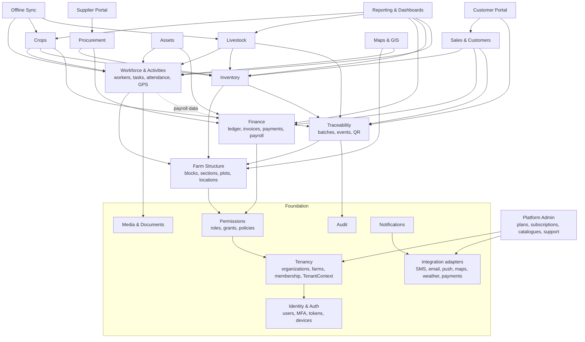

# 09 — Module Dependency Map

Arrows mean "depends on / calls". Dependencies only point **downwards**:
foundation modules never depend on business modules. Business modules
communicate through service interfaces and domain events, never through each
other's tables.

Audit, Notifications and Media are used by nearly every module; only a few of
those arrows are drawn.

## Key interfaces between modules

| Provider | Interface | Used by |
|---|---|---|
| Tenancy | `TenantContext`, `BelongsToFarm` trait, `ResolveFarmContext` middleware | All farm modules |
| Permissions | `Gate` / policies with `can('crops.harvest.create')`, `ScopeResolver` (all / assigned / own) | All |
| Workforce | `ActivityService::create/submit/verify`, events `ActivityVerified` | Crops, Livestock, Assets, Inventory (store tasks) |
| Inventory | `StockService::receive/issue/transfer/adjust` (transactional, row-locked) | Procurement, Crops, Livestock, Sales |
| Finance | `LedgerService::post(JournalEntry)`, `CostCenter` value object | Procurement, Inventory (valuation), Sales, Workforce (payroll), Assets |
| Finance | `Payables` registry and `Payable` contract: each module registers the documents payments can settle (ADR-0012) | Sales (customer invoices), Procurement (supplier invoices) |
| Livestock | Completed `SaleRequest`s, billed on customer invoices | Sales |
| Traceability | `Recorder::createBatch/link/record/correct` | Crops, Livestock, Inventory, Procurement, Sales |
| Media | `MediaService::attach`, signed URLs | All |
| Notifications | `Notifier::send(Notification, recipients)` (queued, multi-channel) | All |

## Build order that follows from the graph

1. Identity → Tenancy → Permissions → Audit → Media → Notifications (foundation)
2. Platform Admin
3. Farm Structure
4. **Workforce & Activities, plus the Traceability core** (batches, events,
   recorder). These come before Crops and Livestock because both depend on
   them. Adding traceability afterwards would leave gaps in the history.
5. Inventory → Finance ledger core → Procurement
6. Crops, Livestock (can run in parallel)
7. Sales & Customers → Supplier and Customer portals
8. QR / public traceability, Maps, Reporting, Sync hardening, Integrations

[10 — Roadmap](10-roadmap.md) maps this onto the 15 phases in the
requirements.
